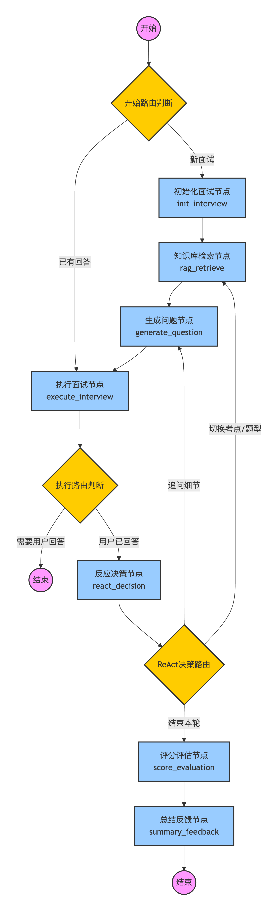

# **智能模拟面试 Agent 系统**

简历和目标岗位，系统会模拟面试官进行多轮问答，并生成复盘反馈。

## 能做什么

- **个性化面试**：分析你的简历和岗位要求，定制专属面试问题
- **智能追问**：根据你的回答深度挖掘，不只是简单问答
- **知识点覆盖**：系统性地考察技术栈，不留盲区
- **即时反馈**：每个回答都有质量评估，面试后生成完整报告

## 使用前注意事项

- app/core/config.py配置密钥
- app/database/init_tables.py初始化db
- 对话状态自动保存至本地，支持中断后继续
- 可以上传新题库到向量数据库中，参考app/utils/rag_load_1.py

## langgraph结构

1. **初始化节点** (`init_interview`)：解析简历，计划考点和题型。

   - 从简历中解析项目
   - 分析通用考点和项目考点
   - 确定第一道题的面试题型

2. **检索节点** (`rag_retrieve`)：从知识库召回面试题和技术点素材。

   - 根据project_tech_points、general_tech_points、current_topic_type确定当前要执行检索的考点
   - 从向量数据库中检索考点该相关的问题

3. **问题生成节点** (`generate_question`)：结合多源信息生成面试问题 

4. **执行面试节点** (`execute_interview`)：展示问题并接收用户回答

   - 结束，等待用户回答

   - 用户已经回答，评估回答质量

5. **反应决策节点** (`react_decision`)：评估回答质量并决定下一步

   - 【追问细节】	followup：面试题生成节点            

   - 【切换考点】	switch_topic：检索节点    

   - 【切换题型】	switch_type：检索节点

   - 【结束本轮】	end：面试评估节点

6. **评分评估节点** (`score_evaluation`)：分题型评分并标记薄弱点 

7. **总结反馈节点** (`summary_feedback`)：生成最终复盘报告

## 主要流程路径

1. **新面试流程**：开始 → 初始化 → 检索 → 生成问题 → 执行面试
2. **继续面试流程**：开始 → 执行面试 → 反应决策 → 根据不同决策分流
3. **结束流程**：评分评估 → 总结反馈 → 结束

## 后续计划

- 输出校验机制
- 生成问题节点从graph中抽离出来，实现流式输出。
- 面试时长控制
- 实现语音交互
